# honest-type: Language-Agnostic Architecture Specification

**Version:** 0.1 (Draft)
**Date:** March 11, 2026
**Status:** In progress — being developed interactively

---

## 1. Purpose

This document is the bridge between the Honest Framework vision spec and any language-specific implementation. It defines the exact algorithms, data structures, edge case rules, and conformance requirements that every implementation of honest-type must satisfy.

An implementor reading this document should be able to build a conformant honest-type in any language with Sets and first-class functions, without reading the Python or JavaScript source code.

### 1.1 honest-type is General Purpose

**honest-type has no dependency on web, HTTP, or any I/O layer.** It is a general-purpose type system based on pure function tables. Tokens in, manifest out. That's the whole contract.

The Honest Framework builds a web application framework *on top of* honest-type — but honest-type itself is equally applicable to:

- CLI argument parsing
- Config file and environment variable classification
- Message queue and event stream processing
- ETL pipelines and data transformation
- Game logic and domain-specific languages
- Log parsing and file processing
- Any context where untyped strings need to become typed, named data

The boundary concept — I/O at the edges, pure functions in the middle — applies in all of these contexts. The *form* of the boundary differs (HTTP response, CLI error message, dead letter queue, log entry) but the *pattern* is identical.

### 1.2 The Honest Framework Layering

```
honest-type       — completely general. No web, no HTTP, no I/O.
                    Tokens in, manifest out. Pure functions only.

honest-state      — completely general. Pure function state machines
                    as lookup tables. States and events are vocabularies.
                    Transitions are bindings. No classes, no mutation.

honest-check      — general. Static verification of any honest-type
honest-test         usage, web or otherwise. Includes state machine
                    reachability and dead state detection.

honest-py         — web application layer. Brings honest-type to
honest-js           HTTP, ASGI, HTMX, and the DOM.
```

Components in the top group are described in this document. Components in the bottom group are described in the framework spec and depend on honest-type as a foundation.

---

## 2. Reserved Words

Vocabulary construction must reject any Set member that collides with a reserved word. Reserved words are organized in three layers. Layers 1 and 2 are defined by this spec and mandatory for all implementations. Layer 3 is mandatory but implementation-defined.

### Layer 1: Framework Reserved

These are honest-type's own structural nouns. They must never appear as vocabulary Set members because they collide with the framework's data structures.

```
manifest, ticket, rejection, fault, vocabulary, binding,
link, chain, recognizer, slot, token, widget, grid, cell
```

### Layer 2: Cross-Language Minimum

Common reserved words across target languages. Prevents vocabulary values from colliding with language constructs in any implementation.

```
if, else, elif, for, while, do, switch, case, break, continue, return,
class, import, export, from, as, with, yield, async, await,
function, def, var, let, const, static, new, delete,
try, catch, finally, throw, raise, except,
true, false, null, nil, None, undefined, NaN,
self, this, super,
and, or, not, in, is, typeof, instanceof,
int, float, str, string, bool, boolean, void,
public, private, protected, abstract, interface, extends, implements,
print, puts, echo, console, require, include, module, package
```

### Layer 3: Language-Specific

Each implementation extends the blacklist with its language's full reserved word list. For example:

- **Python** adds: `nonlocal`, `global`, `lambda`, `pass`, `assert`, `del`, `exec`, `eval`, ...
- **JavaScript** adds: `arguments`, `debugger`, `enum`, `eval`, `with`, `volatile`, ...
- **Ruby** adds: `begin`, `end`, `ensure`, `rescue`, `unless`, `until`, `when`, ...

### Validation Rule

The vocabulary constructor must check every Set member against all three layers at construction time. If any member is reserved, construction fails with an explicit error naming the offending token and its reservation layer.

Predicate-based recognizers cannot be checked at construction time (their input space is unbounded). Reserved word violations from predicates are caught at classification time — if a predicate matches a reserved word, the token is rejected with a `reserved_word` reason.

---

## 3. Vocabulary Overlap

**A token must match exactly zero or one type in a vocabulary.**

If a token can match more than one type name within the same vocabulary, that vocabulary is invalid. This is not a runtime decision — it is a design error caught at construction time or by the linter.

### Enforcement

| Recognizer combination | When detected | How |
|---|---|---|
| Set ∩ Set | Construction time | Compute set intersection. If non-empty, reject the vocabulary. |
| Set × Predicate | honest-test | Run every Set member through every predicate. Flag any match. |
| Predicate × Predicate | honest-test | Cannot be proven statically. Empirical testing with adversarial inputs. |

### Vocabulary Merge

`vocab_a | vocab_b` produces a new vocabulary containing all type names from both. The merge fails at construction time if:

1. Both vocabularies define the same type name (name collision)
2. Any Set member in one vocabulary appears in a Set of the other vocabulary under a different type name (value collision)

Predicate overlaps across merged vocabularies are caught by honest-test, not at merge time.

---

## 4. Compositional Types

### 4.1 Why Compositional Types

The original spec used three separate mechanisms: vocabularies (classify tokens), flat binding (map types to slots), and context binding (map *pairs* of types to slots). Context binding was the odd one out — a special-case patch for when the same base type needs different slot assignments depending on what else is present.

Compositional types eliminate context binding entirely. Instead of a separate mechanism, the *type itself* carries the context. This is the Haskell insight: if you need to express "an integer in a currency context," make that a type — `currency_precision` — not a rule in a side table.

**Result: two mechanisms instead of three.** Vocabularies classify. Bindings bind. The type system does the context work.

### 4.2 Base Types and Composed Types

A **base type** is a recognizer that classifies a single token:

```
"format_name":   {"currency", "number", "percent"}   — Set recognizer
"currency_code": {"USD", "EUR", "GBP"}               — Set recognizer
"integer":       predicate(is_digit)                  — predicate recognizer
```

A **composed type** is a multi-token recognizer. It matches when specific base type classifications are all present in the input:

```
composed("currency_precision",
    requires = {"format_name": "currency"},
    captures = "integer",
)
```

This reads: "when `format_name` is classified with value `currency` **and** an `integer` is present, this composed type matches. The integer's value is what gets bound."

Two parts:
- **requires** — base type/value pairs that must be present. These tokens are still bound by their own base bindings.
- **captures** — the base type whose value this composed type claims. This token gets bound to the composed type's slot *instead of* its base type's slot.

### 4.3 Composed Types in the Binding Table

Composed types sit in the same flat binding table as base types. No separate mechanism:

```
binding = {
    "format_name":          "format",
    "currency_code":        "currency",
    "integer":              "precision",         # default: integer → precision
    "currency_precision":   "decimals",          # override: when currency, integer → decimals
    "date_year":            "year",              # override: when date, integer → year
}
```

**Override rule:** if a token's base type is captured by a composed type whose requirements are met, the composed type's binding wins. The base type's binding is suppressed for that token.

**No-ambiguity rule:** a token can be captured by at most one composed type. If two composed types would both capture the same token (i.e., their requirements are both satisfied), that is a vocabulary design error — caught at construction time when possible, by honest-test otherwise.

### 4.4 Staying fully listable

Composed types stay fully listable:

- **Set & Set** → finite. The composed type's count is the product of its parts. `currency_precision` with `requires = {"format_name": "currency"}` and `captures = "integer"` over a finite integer Set of 4 values = 1 × 4 = 4 test cases.
- **Set & Predicate** → open-ended. Same as having an open-ended predicate in the vocabulary — composition doesn't create open-endedness, it inherits it.
- **Predicate & Predicate** → open-ended. Same as above.

**Rule: a composed type is finite exactly when all its parts are finite.**

honest-test lists out composed types the same way it would any other type — the composition just splits the space of combinations into named types rather than leaving it implicit.

---

## 5. Maybe (Optional Binding)

### 5.1 The Problem

Without Maybe, there are two states for a slot in the manifest:
1. Present (token was provided and classified)
2. Absent (key missing from the dict)

But "absent" is ambiguous — it could mean "the token wasn't provided" (fine) or "the token was provided but rejected" (problem). The downstream function can't tell the difference.

### 5.2 Three States

Maybe introduces explicit optionality. A binding slot can be:

| State | Meaning | In manifest |
|---|---|---|
| `Just value` | Token present, classified, bound | `slot: value` |
| `Nothing` | Token absent — and that's fine | `slot: Nothing` |
| (rejection) | Token present but unrecognized | In `_rejections`, not in manifest |

### 5.3 Required vs Optional Bindings

The binding table declares which slots are required and which are optional:

```
binding = {
    "format_name":   "format",                # required — absence is a rejection
    "currency_code": "currency",              # required
    "integer":       maybe("precision"),       # optional — absence is Nothing
}
```

A **required** binding means: if no token in the input matches this type, that is a rejection (`missing_required`). The manifest will have an entry in `_rejections`.

A **maybe** binding means: if no token matches this type, the slot is present in the manifest with value `Nothing`. No rejection. The manifest shape is fully predictable from the binding table.

### 5.4 Maybe and Composed Types

Composed types can use Maybe for their captured type:

```
composed("currency_precision",
    requires = {"format_name": "currency"},
    captures = maybe("integer"),
)

binding = {
    ...
    "currency_precision": "decimals",    # Nothing if currency present but no integer
}
```

When `format_name` is `"currency"` but no `integer` is present: `decimals: Nothing`.
When `format_name` is `"currency"` and `integer` is `"2"`: `decimals: "2"`.
When `format_name` is not `"currency"`: the composed type doesn't match at all.

### 5.5 Staying fully listable, with Maybe

Maybe adds exactly one more case to the list: `Nothing`.

For a bounded Set of 4 integers: `maybe("integer")` has 5 test cases (4 values + Nothing).
For an unbounded predicate: still unbounded, plus Nothing.

This plays cleanly with honest-test — `Nothing` is just another value to enumerate.

### 5.6 Language Mapping

| Language | Just value | Nothing |
|---|---|---|
| Python | `value` | `None` |
| JavaScript | `value` | `null` |
| Ruby | `value` | `nil` |
| Go | `&value` (pointer) | `nil` |
| Elixir | `{:ok, value}` | `:nothing` |

Each implementation maps to its language's idiomatic nullable/optional representation.

---

## 6. The classify() Algorithm

### Overview

`classify()` takes a list of raw string tokens and produces a manifest: a flat dict mapping slot names to classified values. It uses a **two-pass** algorithm to guarantee order-independence.

```
classify(tokens, vocabulary, binding) → manifest
```

**Binding is optional.** If omitted, the framework generates an automatic 1:1 binding — every type name becomes its own slot name. The programmer only provides a binding table when they want to rename types to something more meaningful in their application context.

```
classify(tokens, vocabulary)            // auto binding: type names = slot names
classify(tokens, vocabulary, binding)   // explicit binding: programmer-defined slot names
```

Note: no `context_binding` parameter. Composed types are part of the vocabulary. The binding table is unified.

### Why Two Passes

The framework guarantees **order-independence**: the same tokens in any order produce the same manifest. Composed types depend on knowing which base types are present in the *entire* input, not just what has been seen so far. A single-pass approach would make composition dependent on token order. Two passes eliminate this.

### Pass 1: Base Classification

For each token in the input, scan the vocabulary's base types and produce a ticket.

```
FUNCTION classify_token(token, vocabulary):
    matched_type ← null

    FOR EACH (type_name, recognizer) IN vocabulary.base_types:
        IF recognizer is a Set:
            match ← token ∈ recognizer
        ELSE (recognizer is a predicate):
            match ← recognizer(token)
            IF match AND token ∈ RESERVED_WORDS:
                RETURN rejection(token, "reserved_word")

        IF match:
            IF matched_type ≠ null:
                ERROR "Vocabulary overlap: token matches both
                       matched_type and type_name"
                       (should not happen if vocabulary was validated)
            matched_type ← type_name

    IF matched_type = null:
        RETURN rejection(token, "unrecognized")

    RETURN ticket(type=matched_type, value=token)
```

Pass 1 produces a list of tickets and rejections. No binding happens yet.

### Pass 2: Composition and Binding Resolution

With all tickets classified, resolve composed types, then bind all slots.

```
FUNCTION resolve_bindings(tickets, vocabulary, binding):
    manifest ← {}
    rejections ← []
    captured ← {}    // tracks which tickets are captured by composed types

    // Collect all classified tickets (for composition lookup)
    ticket_by_type ← GROUP tickets BY type (excluding rejections)

    // --- Phase 2a: Resolve composed types ---
    FOR EACH comp IN vocabulary.composed_types:

        // Check if all requirements are met
        requirements_met ← true
        FOR EACH (req_type, req_value) IN comp.requires:
            IF req_type NOT IN ticket_by_type:
                requirements_met ← false
                BREAK
            IF ticket_by_type[req_type].value ≠ req_value:
                requirements_met ← false
                BREAK

        IF NOT requirements_met:
            // If captures is maybe, slot gets Nothing
            IF comp.captures is maybe:
                // Only emit Nothing if requirements COULD match
                // (i.e., if the capture is missing, not the requires)
                SKIP — see detailed rule below
            CONTINUE

        // Check if captured type is present
        capture_type ← comp.captures.type   // unwrap maybe if present
        IF capture_type IN ticket_by_type:
            captured_ticket ← ticket_by_type[capture_type]
            captured[captured_ticket] ← comp.name
            // Bind composed type's slot
            slot ← binding[comp.name]
            manifest[slot] ← captured_ticket.value
        ELSE IF comp.captures is maybe:
            slot ← binding[comp.name]
            manifest[slot] ← Nothing
        ELSE:
            // Required capture not present — no match
            CONTINUE

    // --- Phase 2b: Bind remaining tickets (not captured) ---
    FOR EACH item IN tickets:
        IF item is a rejection:
            APPEND item TO rejections
            CONTINUE

        IF item IN captured:
            CONTINUE    // already bound by composed type

        IF item.type IN binding:
            slot_or_maybe ← binding[item.type]
            slot ← unwrap_maybe(slot_or_maybe)

            IF slot ∈ manifest:
                APPEND rejection(item.value, "duplicate_slot", slot) TO rejections
                CONTINUE

            manifest[slot] ← item.value
        ELSE:
            APPEND rejection(item.value, "unbound_type", item.type) TO rejections

    // --- Phase 2c: Fill in Nothing for unmatched maybe bindings ---
    FOR EACH (type_name, slot_or_maybe) IN binding:
        IF slot_or_maybe is maybe:
            slot ← unwrap_maybe(slot_or_maybe)
            IF slot NOT IN manifest:
                manifest[slot] ← Nothing

    // --- Phase 2d: Check required bindings ---
    FOR EACH (type_name, slot_or_maybe) IN binding:
        IF slot_or_maybe is NOT maybe:
            slot ← slot_or_maybe
            IF slot NOT IN manifest AND type_name NOT IN vocabulary.composed_types:
                APPEND rejection(null, "missing_required", type_name) TO rejections

    manifest["_rejections"] ← rejections IF rejections is not empty ELSE absent
    RETURN manifest
```

### Full Algorithm

```
FUNCTION classify(tokens, vocabulary, binding=null):
    // If no binding provided, generate automatic 1:1 binding
    IF binding = null:
        binding ← auto_binding(vocabulary)

    // Pass 1: Classify each token against base types
    tickets ← []
    FOR EACH token IN tokens:
        result ← classify_token(token, vocabulary)
        APPEND result TO tickets

    // Pass 2: Resolve compositions and bind
    RETURN resolve_bindings(tickets, vocabulary, binding)

FUNCTION auto_binding(vocabulary):
    // Identity mapping: every type name becomes its own slot name
    result ← {}
    FOR EACH type_name IN vocabulary.base_types:
        result[type_name] ← type_name
    FOR EACH comp IN vocabulary.composed_types:
        result[comp.name] ← comp.name
    RETURN result
```

### Worked Example

Given:

```
vocabulary = {
    base_types: {
        "format_name":   {"currency", "number", "percent"},
        "currency_code": {"USD", "EUR", "GBP"},
        "integer":       predicate(is_digit),
    },
    composed_types: [
        composed("currency_precision",
            requires = {"format_name": "currency"},
            captures = "integer",
        ),
    ],
}

binding = {
    "format_name":          "format",
    "currency_code":        "currency",
    "integer":              "precision",         # default
    "currency_precision":   "decimals",          # override when currency present
}
```

**Input tokens (any order):** `["2", "EUR", "currency"]`

**Pass 1 — Base Classification:**

| Token | Matched Type | Result |
|---|---|---|
| `"2"` | integer | ticket(type="integer", value="2") |
| `"EUR"` | currency_code | ticket(type="currency_code", value="EUR") |
| `"currency"` | format_name | ticket(type="format_name", value="currency") |

**Pass 2a — Composed Type Resolution:**

| Composed Type | Requires | Met? | Captures | Result |
|---|---|---|---|---|
| currency_precision | format_name="currency" | Yes (ticket exists with value "currency") | integer | Captures integer ticket. Binds "decimals" → "2" |

**Pass 2b — Remaining Bindings:**

| Ticket | Captured? | Binding | Result |
|---|---|---|---|
| integer/"2" | Yes (by currency_precision) | skipped | — |
| currency_code/"EUR" | No | "currency" | manifest["currency"] = "EUR" |
| format_name/"currency" | No | "format" | manifest["format"] = "currency" |

**Final manifest:**
```
{
    "format":   "currency",
    "currency": "EUR",
    "decimals": "2",
}
```

Note: `"precision"` is absent — the integer was captured by `currency_precision`, so its base binding was suppressed.

**Same tokens without `"currency"`:** `["2", "EUR", "number"]`

Now `format_name` = `"number"`, so `currency_precision`'s requirement is not met. The integer falls through to its base binding:

```
{
    "format":    "number",
    "currency":  "EUR",
    "precision": "2",
}
```

### Worked Example with Maybe

```
binding = {
    "format_name":   "format",
    "currency_code": maybe("currency"),      # optional
    "integer":       maybe("precision"),      # optional
}
```

**Input tokens:** `["currency"]`

**Pass 1:** ticket(type="format_name", value="currency")

**Pass 2b:** format_name → format = "currency"

**Pass 2c:** currency_code is maybe, slot "currency" not in manifest → Nothing.
integer is maybe, slot "precision" not in manifest → Nothing.

**Final manifest:**
```
{
    "format":    "currency",
    "currency":  Nothing,
    "precision": Nothing,
}
```

Every declared slot is present. No guessing. No "check if key exists."

---

## 7. Data Structure Schemas

### ticket

The result of classifying a single token.

```
ticket = {
    type:  String    — the vocabulary type name that matched
    value: String    — the original token
}
```

### rejection

A token that could not be classified or bound, or a required slot that was missing.

```
rejection = {
    token:  String?  — the original token (null for missing_required)
    reason: String   — one of: "unrecognized", "reserved_word",
                       "unbound_type", "duplicate_slot", "missing_required",
                       "empty_token", "null_token"
    detail: String?  — additional context (e.g., which type or slot conflicted)
}
```

### manifest

The fully resolved output of `classify()`. A flat dict of slot→value pairs. Slots declared as `maybe()` are always present (as value or Nothing). Required slots are present only if a matching token was classified.

```
manifest = {
    [slot_name]: String | Nothing   — bound values or explicit absence
    _rejections: [rejection]?       — present only if there are rejections
}
```

The manifest is always flat (no nesting). Slot names come from the binding table, not from the vocabulary. The manifest does not preserve type information — if you need to know *what type* a value was classified as, inspect the tickets (which are an intermediate result, not part of the manifest).

### fault

An error in a chain. Data, not an exception.

```
fault = {
    code:    String   — machine-readable error identifier
    message: String   — human-readable description
    link:    String?  — name of the chain link that produced the fault
    input:   dict?    — the manifest that was passed to the failing link
}
```

### composed

A multi-token recognizer definition.

```
composed = {
    name:     String                       — the composed type's name
    requires: { type_name: value, ... }    — base types/values that must be present
    captures: String | maybe(String)       — the base type whose value gets bound
}
```

---

## 7b. honest-state

The complete honest-state specification — including the full state taxonomy, DATAOS client-side primitives (manifest, collect, apply, observe), pure function state machines, cross-machine guards, transition history, and conformance requirements — is defined in `honest-state-architecture.md`. That document is the canonical reference. This section is a pointer only.

---

## 7c. honest-state — Pure Function State Machines (archived reference)

### Overview

A state machine is a lookup table: `(current_state, event) → next_state`. States and events are vocabularies. The transition table is a binding. No classes, no mutation — the machine is pure data and the executor is a pure function.

### Data Structures

```
state_machine = {
    states:      vocabulary   — all valid state names (Set recognizer)
    events:      vocabulary   — all valid event names (Set recognizer)
    transitions: {
        (state, event): next_state   — transition table
    }
    initial:     String       — the starting state
    terminal:    [String]?    — optional terminal states (machine stops here)
}
```

### The transition() Function

```
FUNCTION transition(machine, current_state, event):
    // Validate inputs against vocabularies
    IF current_state NOT IN machine.states:
        RETURN fault("invalid_state", category="server")
    IF event NOT IN machine.events:
        RETURN fault("invalid_event", category="client")

    key ← (current_state, event)

    IF key NOT IN machine.transitions:
        RETURN fault("no_transition",
            category = "client",
            detail   = { state: current_state, event: event }
        )

    next ← machine.transitions[key]
    RETURN ok({ state: next })
```

The state machine executor is a pure function. It takes the current state and an event, returns the next state wrapped in a Result. The caller is responsible for storing state — the machine itself is stateless.

### Example

```
order_machine = state_machine(
    states  = vocabulary({ "order_state": {"pending", "paid", "shipped", "cancelled"} }),
    events  = vocabulary({ "order_event": {"pay", "ship", "cancel", "refund"} }),
    initial = "pending",
    terminal = ["cancelled"],
    transitions = {
        ("pending",  "pay"):    "paid",
        ("pending",  "cancel"): "cancelled",
        ("paid",     "ship"):   "shipped",
        ("paid",     "cancel"): "cancelled",
        ("shipped",  "refund"): "cancelled",
    }
)

result = transition(order_machine, current_state="pending", event="pay")
// ok({ state: "shipped" })

result = transition(order_machine, current_state="pending", event="ship")
// fault({ code: "no_transition", category: "client", ... })
```

### honest-check Integration

Because states and events are vocabularies, honest-check can verify state machines statically:

| Rule | Description |
|---|---|
| HC-SM01 | State referenced in transition table not in states vocabulary |
| HC-SM02 | Event referenced in transition table not in events vocabulary |
| HC-SM03 | State is unreachable (no transition leads to it, and it is not initial) |
| HC-SM04 | Non-terminal state has no outgoing transitions (dead state) |
| HC-SM05 | Initial state not in states vocabulary |

---

## 8. Architectural Diagrams

### 8.1 The Two-Pass classify() Flow

```mermaid
flowchart TD
    input["Raw Tokens\n&lbrack;&quot;currency&quot;, &quot;EUR&quot;, &quot;2&quot;&rbrack;"]

    subgraph pass1["Pass 1: Base Classification"]
        direction TB
        scan["For each token,\nscan base types"]
        set_check{"Set\nmember?"}
        pred_check{"Predicate\nmatch?"}
        reserved{"Reserved\nword?"}
        make_ticket["ticket\n{type, value}"]
        make_reject["rejection\n{token, reason}"]

        scan --> set_check
        set_check -->|yes| make_ticket
        set_check -->|no| pred_check
        pred_check -->|yes| reserved
        reserved -->|no| make_ticket
        reserved -->|yes| make_reject
        pred_check -->|no| make_reject
    end

    tickets["All Tickets\nformat_name/currency\ncurrency_code/EUR\ninteger/2"]

    subgraph pass2["Pass 2: Composition + Binding"]
        direction TB

        subgraph phase_a["2a: Composed Types"]
            comp_check{"Requirements\nmet?"}
            capture["Capture token\noverride base binding"]
            no_comp["Skip or\nNothing if maybe"]

            comp_check -->|yes| capture
            comp_check -->|no| no_comp
        end

        subgraph phase_b["2b: Base Bindings"]
            captured_check{"Already\ncaptured?"}
            bind_base["Bind\nslot → value"]
            skip["Skip"]

            captured_check -->|no| bind_base
            captured_check -->|yes| skip
        end

        subgraph phase_c["2c: Maybe Fill"]
            fill["Set unmatched\nmaybe slots\nto Nothing"]
        end
    end

    manifest["Manifest\n{format: &quot;currency&quot;,\ncurrency: &quot;EUR&quot;,\ndecimals: &quot;2&quot;}"]

    input --> pass1
    pass1 --> tickets
    tickets --> pass2
    phase_a --> phase_b
    phase_b --> phase_c
    pass2 --> manifest

    style pass1 fill:#1a2a1a,stroke:#4a9,stroke-width:2px
    style pass2 fill:#1a1a2a,stroke:#49a,stroke-width:2px
    style phase_a fill:#1a1a3a,stroke:#66a,stroke-width:1px
    style phase_b fill:#1a1a3a,stroke:#66a,stroke-width:1px
    style phase_c fill:#1a1a3a,stroke:#66a,stroke-width:1px
    style manifest fill:#2a1a1a,stroke:#a94,stroke-width:2px
```



### 8.2 Compositional Types: How Composed Types Override Base Bindings

```mermaid
flowchart LR
    subgraph tokens["Classified Tickets"]
        t1["format_name\n= &quot;currency&quot;"]
        t2["currency_code\n= &quot;EUR&quot;"]
        t3["integer\n= &quot;2&quot;"]
    end

    subgraph composed["Composed Type Resolution"]
        comp["currency_precision\nrequires: format_name=currency\ncaptures: integer"]
        req_check["Requirement\nformat_name=currency?\n✓ YES"]
        cap_claim["Captures integer ticket\nOverrides base binding"]
    end

    subgraph binding_table["Unified Binding Table"]
        b1["format_name → format"]
        b2["currency_code → currency"]
        b3["integer → precision\n(suppressed)"]
        b4["currency_precision → decimals\n(active)"]
    end

    subgraph result["Manifest"]
        m["format: currency\ncurrency: EUR\ndecimals: 2\n\nprecision: ✗ suppressed"]
    end

    t1 --> req_check
    t3 --> cap_claim
    req_check --> cap_claim
    cap_claim --> b4
    t1 --> b1
    t2 --> b2
    b1 --> m
    b2 --> m
    b4 --> m

    style tokens fill:#1a2a1a,stroke:#4a9,stroke-width:2px
    style composed fill:#2a1a2a,stroke:#a4a,stroke-width:2px
    style binding_table fill:#1a1a2a,stroke:#49a,stroke-width:2px
    style result fill:#2a1a1a,stroke:#a94,stroke-width:2px
```



### 8.3 Maybe: Three Token States

```mermaid
flowchart TD
    token_present["Token provided\ne.g., &quot;EUR&quot;"]
    token_absent["Token not\nprovided"]
    token_bad["Token provided\nbut unrecognized\ne.g., &quot;XYZ&quot;"]

    classify_ok["Classified\ntype: currency_code\nvalue: EUR"]
    nothing["Nothing\n(explicit absence)"]
    rejected["Rejection\n{token: XYZ,\nreason: unrecognized}"]

    slot_just["Manifest slot\ncurrency: &quot;EUR&quot;"]
    slot_nothing["Manifest slot\ncurrency: Nothing"]
    slot_reject["In _rejections\n(not in manifest)"]

    token_present --> classify_ok --> slot_just
    token_absent --> nothing --> slot_nothing
    token_bad --> rejected --> slot_reject

    note_required["If binding is required:\nabsence → rejection\n(missing_required)"]
    note_maybe["If binding is maybe:\nabsence → Nothing\n(valid, explicit)"]

    token_absent -.-> note_required
    token_absent -.-> note_maybe

    style slot_just fill:#1a2a1a,stroke:#4a9,stroke-width:2px
    style slot_nothing fill:#1a1a2a,stroke:#49a,stroke-width:2px
    style slot_reject fill:#2a1a1a,stroke:#a44,stroke-width:2px
    style note_required fill:#2a1a1a,stroke:#a44,stroke-width:1px,stroke-dasharray: 5 5
    style note_maybe fill:#1a1a2a,stroke:#49a,stroke-width:1px,stroke-dasharray: 5 5
```



### 8.4 The Manifest in the Full Architecture

```mermaid
flowchart LR
    subgraph browser["Browser (honest-js)"]
        dom["DOM\nHTML attributes"]
        boot["honest.boot\nscans h*- prefixes"]
        js_classify["honest-type JS\nclassify()"]
        htmx["HTMX request"]

        dom --> boot
        boot --> js_classify
        js_classify --> htmx
    end

    subgraph server["Server (honest-py)"]
        intake["honest.intake\nASGI middleware"]
        py_classify["honest-type Python\nclassify()"]
        chain_exec["honest.chain\nlink pipeline"]
        persist["honest.persist\npure SQL"]

        intake --> py_classify
        py_classify --> chain_exec
        chain_exec --> persist
    end

    subgraph manifests["Manifests at Every Boundary"]
        m1["Client Manifest\n{format, currency, decimals}"]
        m2["Request Manifest\n{resource, action, id}"]
        m3["Chain Manifest\nflows link → link"]
        m4["Query Manifest\n{table, columns, where}"]
    end

    htmx -->|"HTTP request\nwith typed params"| intake
    persist -->|"HTML response\nwith h*- attributes"| dom

    js_classify -.->|produces| m1
    py_classify -.->|produces| m2
    chain_exec -.->|passes| m3
    persist -.->|typed by| m4

    style browser fill:#1a1a2a,stroke:#49a,stroke-width:2px
    style server fill:#1a2a1a,stroke:#4a9,stroke-width:2px
    style manifests fill:#2a1a2a,stroke:#a4a,stroke-width:2px
```



### 8.5 Chain Execution and Fault Propagation

```mermaid
flowchart TD
    input_manifest["Input Manifest\n{email, role, name}"]

    subgraph chain["Chain: create_user_pipeline"]
        direction TB

        link1["validate_email\nmanifest → manifest | fault"]
        link2["check_duplicate\nmanifest → manifest | fault"]
        link3["hash_password\nmanifest → manifest"]
        link4["insert_user\nmanifest → user_record\n⚠ boundary: I/O"]
        link5["format_response\nuser_record → response"]

        link1 -->|manifest| link2
        link2 -->|manifest| link3
        link3 -->|manifest| link4
        link4 -->|user_record| link5
    end

    success["Response\n{id, email, role}"]
    link5 --> success

    fault1["Fault\n{code: invalid_email}"]
    fault2["Fault\n{code: duplicate_user}"]

    link1 -->|fault| fault1
    link2 -->|fault| fault2

    boundary["@catch_at_boundary\nfault → HTTP 400/422\ndata → HTTP 200"]

    fault1 --> boundary
    fault2 --> boundary
    success --> boundary

    http["HTTP Response"]
    boundary --> http

    style chain fill:#1a1a2a,stroke:#49a,stroke-width:2px
    style boundary fill:#2a1a1a,stroke:#a94,stroke-width:2px
    style fault1 fill:#2a1a1a,stroke:#a44,stroke-width:1px
    style fault2 fill:#2a1a1a,stroke:#a44,stroke-width:1px
```



---

## 9. Edge Case Rules

These rules are mandatory for all implementations. They define classify()'s behavior at every boundary condition. No implementation-defined behavior is permitted for these cases.

### 9.1 Case Sensitivity

**Vocabulary matching is case-sensitive by default.**

`"USD"` matches only `"USD"`. It does not match `"usd"`, `"Usd"`, or `"USD "`.

To opt into case-insensitive matching for a specific recognizer, wrap it with `insensitive()`:

```
"currency_code": insensitive({"USD", "EUR", "GBP"})
```

`insensitive()` normalizes both the Set members and the incoming token to lowercase before testing membership. The *original* token value is preserved in the ticket — the normalization is only for matching purposes.

`insensitive()` applies only to Set recognizers. Predicates handle their own case logic internally.

### 9.2 Whitespace

**Boundary code is responsible for trimming tokens. classify() receives pre-trimmed strings.**

Leading and trailing whitespace is stripped before tokens reach classify(). Internal whitespace is preserved — `"New York"` remains `"New York"`.

This stripping is a boundary responsibility, expressed as a lookup table entry, not imperative code. The boundary opts in to trimming. classify() does not trim — it trusts its input.

If a token arrives at classify() with leading or trailing whitespace, it is classified as-is. Whether it matches depends on the vocabulary.

### 9.3 Empty Tokens

**classify() rejects empty strings with reason `"empty_token"`.**

An empty string `""` carries no information. It is not unrecognized — it is nothing. classify() rejects it explicitly rather than silently discarding it, so the caller can see what happened.

Boundary code decides what to do with empty strings *before* calling classify(). The decision lives in a lookup table at the boundary:

```
empty_token_policy = {
    "split_artifact": "discard",    # e.g., double space in attribute value
    "blank_field":    "pass",       # e.g., user left a form field empty
}
```

If boundary code discards the empty string, classify() never sees it. If boundary code passes it through, classify() produces a `"empty_token"` rejection.

### 9.4 Null Tokens

**classify() rejects null/None/nil tokens with reason `"null_token"`.**

Null is distinct from empty string. `"null_token"` and `"empty_token"` are separate reason codes because they represent different conditions — null means the caller had no value at all, empty means the caller had an explicitly empty string.

Same boundary policy applies: boundary code decides whether to discard nulls or pass them through. If passed through, classify() produces a `"null_token"` rejection.

### 9.5 Non-String Tokens

**classify() faults on non-string input.**

The recognizer contract is `String → Boolean`. A non-string token (integer, float, boolean, object) violates that contract. This is a server bug — the boundary failed to extract tokens as strings.

```
fault(
    code    = "non_string_token",
    message = "classify() requires string tokens. Got: {type} {value}",
    detail  = { token: value, received_type: type }
)
```

**Boundary code may coerce non-strings to strings** before calling classify(). This is a valid boundary responsibility, expressed as a lookup table:

```
coercion_rules = {
    "integer": str,     # 2     → "2"
    "float":   str,     # 3.14  → "3.14"
    "boolean": str,     # true  → "true"
    "null":    discard, # null  → removed from token list
}
```

If boundary code coerces, classify() never sees a non-string. If boundary code does not coerce and a non-string reaches classify(), that is a fault.

### 9.6 Predicate Exceptions

**A predicate that throws produces a fault, not a rejection.**

A throwing predicate is a server bug — the predicate failed its own `String → Boolean` contract. This is categorically different from a rejection, which signals bad *client* input.

```
fault(
    code    = "predicate_error",
    message = "Predicate for type '{type_name}' threw on token '{token}'",
    detail  = { type_name: name, token: value, exception: e }
)
```

This fault propagates up through the chain and becomes a server error at the boundary — HTTP 500, CLI exit 2, dead letter queue, or whatever the context requires. The developer sees it immediately. It is never swallowed silently.

honest-check (the linter) should warn about predicates that can throw for common inputs (HC009: predicate may throw on non-matching input).

### 9.7 Duplicate Tokens

**Duplicate tokens are handled by the existing `duplicate_slot` rejection.**

If two tokens classify to the same type and bind to the same slot, the second token produces a `"duplicate_slot"` rejection. No special-case logic is needed — the algorithm catches this naturally in Phase 2b.

This applies equally to required and maybe slots. A maybe slot filled by one token cannot be filled again by a second token of the same type.

### 9.8 Empty Token List

**`classify([], vocabulary, binding)` returns a manifest with rejections.**

An empty token list is valid input. classify() runs both passes normally:

- Pass 1 produces no tickets.
- Pass 2 finds no tickets to bind.
- Phase 2c fills all maybe slots with `Nothing`.
- Phase 2d appends `missing_required` rejections for all required bindings.

The result is a manifest with `Nothing` for every maybe slot and `_rejections` listing every unsatisfied required binding. This is honest — the caller asked for a classification and received an accurate account of what was and wasn't provided.

### Rule Summary

| Condition | classify() behavior | Who decides policy |
|---|---|---|
| Mixed case token | Not matched (case-sensitive) | Use `insensitive()` in vocabulary |
| Whitespace in token | Classified as-is | Boundary code trims before calling |
| Empty string `""` | Rejected: `empty_token` | Boundary code filters or passes through |
| Null/None | Rejected: `null_token` | Boundary code filters or passes through |
| Non-string | Fault: `non_string_token` | Boundary code coerces or classify() faults |
| Predicate throws | Fault: `predicate_error` | Not recoverable — server bug |
| Duplicate tokens | Rejected: `duplicate_slot` | Vocabulary design should prevent |
| Empty token list | `missing_required` rejections + `Nothing` for maybe | Normal operation |

---

## 10. Chain Execution Model

### 10.1 The Result Type

Every link returns exactly one of two things:

```
ok(manifest)          → { "ok": manifest }
fault(code, message)  → { "err": fault_data }
```

These are the only two valid return values from a link. There is no third option. The chain executor checks for `"ok"` or `"err"` — if neither key is present, that is a fault (`non_result_return`).

`ok()` and `fault()` are constructor functions, not classes. They produce plain dicts stamped with their key.

**Language mappings:**

| Language | ok | err |
|---|---|---|
| Python | `{"ok": manifest}` | `{"err": fault_data}` |
| JavaScript | `{ok: manifest}` | `{err: faultData}` |
| Ruby | `{ok: manifest}` | `{err: fault_data}` |
| Go | `Result{Ok: manifest}` | `Result{Err: faultData}` |
| Elixir | `{:ok, manifest}` | `{:error, fault_data}` |

### 10.2 The Manifest as Data Dictionary

The chain passes the **full manifest** to every link. The manifest is the master data dictionary. The chain is the supervisor. Links declare what they need for static verification, but receive everything because:

1. Nested sub-functions within a link may need upstream context their parent didn't anticipate
2. The chain's type system has already verified that everything in the manifest is typed and bound — there are no surprises to protect against

**Declaration vs access:**

- A link *declares* the vocabulary slots it directly uses — for honest-check to verify
- A link *receives* the full manifest — for nested calls when needed
- A link *should* only directly access declared slots — accessing undeclared slots is a design smell that honest-check warns about (HC008 extension)

If a nested sub-function needs a slot, the parent link should declare that slot in its own vocabulary — making the dependency visible at the chain level, not hidden inside implementation.

### 10.3 Chain Execution: Short-Circuit (Default)

The default chain executor runs links in sequence and short-circuits on the first fault.

```
FUNCTION execute_chain(links, initial_manifest):
    current ← initial_manifest

    FOR EACH link IN links:
        result ← link(current)

        IF "err" IN result:
            RETURN result           // short-circuit, propagate fault

        IF "ok" NOT IN result:
            RETURN fault(
                code    = "non_result_return",
                message = "Link returned neither ok nor err",
                link    = link.name,
                input   = current,
            )

        current ← result["ok"]

    RETURN ok(current)
```

The chain itself returns a Result — `ok(final_manifest)` or the first `err` that occurred. The chain is a link. It composes.

### 10.4 validate_all() — Accumulating Combinator

For cases where all links must run regardless of individual failures (form validation, multi-field checks), `validate_all()` wraps a group of links and runs them all against the same input manifest.

```
FUNCTION validate_all(links, manifest):
    results ← []
    any_err ← false

    FOR EACH link IN links:
        result ← link(manifest)     // same manifest every time — no chained transforms
        APPEND result TO results
        IF "err" IN result:
            any_err ← true

    IF any_err:
        RETURN fault(
            code    = "validation_failed",
            results = results,       // EVERY result, ok and err both
        )

    RETURN ok(manifest)
```

**The `results` list contains every link's result — both `ok` and `err`.** The caller sees the complete picture: what passed, what failed, and in what order. No information is discarded.

`validate_all()` has the same signature as a link — it returns `ok` or `err`. It composes cleanly into a larger chain:

```
pipeline = chain(
    validate_all(validate_email, validate_phone, validate_role),
    hash_password,
    insert_user,
)
```

The outer chain does not know or care that the first link is a `validate_all`. It just sees `ok` or `err`.

### 10.5 Link Declaration

A link declares its vocabulary for static verification by honest-check. The declaration does not restrict runtime access — it annotates intent.

```
// Python
@link(accepts=user_vocab, binds=user_binding)
def validate_email(manifest):
    if "@" not in manifest["email"]:
        return fault("invalid_email", f"Bad email: {manifest['email']}")
    return ok(manifest)

// JavaScript
const validateEmail = link(
    { accepts: userVocab, binds: userBinding },
    (manifest) => {
        if (!manifest.email.includes('@'))
            return fault('invalid_email', `Bad email: ${manifest.email}`)
        return ok(manifest)
    }
)
```

The `@link` decorator / `link()` wrapper:
1. Attaches vocabulary metadata for honest-check introspection
2. Does not modify the function's runtime behavior
3. Does not scope or filter the manifest passed to the function

### 10.6 Async Links

Links may be synchronous or asynchronous. The chain executor must support both. An async link is identical in contract — it returns a Result — but its return is a promise/coroutine/future that resolves to a Result.

```
// Python async link
@link(accepts=user_vocab, binds=user_binding)
async def insert_user(manifest):
    async with pool.acquire() as conn:
        user = await query(conn, "INSERT INTO users ...", manifest)
    return ok(user)
```

The chain executor awaits async links automatically. A chain containing any async link is itself async. A chain of all sync links is sync. Implementors must handle both cases.

**I/O in links:** async links are the designated I/O boundary. honest-test flags them as boundary functions (not a purity violation — an expected and explicit boundary). The `@link` decorator accepts an optional `boundary=True` annotation for links that intentionally perform I/O, suppressing the honest-test purity warning.

### 10.7 Chain Composition

Chains compose. A chain is a link. A chain of chains is a chain.

```
validation_chain = chain(validate_all(validate_email, validate_phone, validate_role))
persistence_chain = chain(hash_password, insert_user, format_response)

create_user_pipeline = chain(validation_chain, persistence_chain)
```

The outermost chain has the same `execute_chain` contract. Short-circuit propagates through all levels — a fault in `validation_chain` short-circuits the entire `create_user_pipeline`.

### 10.8 What the Chain Does NOT Do

- **Does not classify tokens.** Classification happens before the chain, at the boundary (honest.intake for HTTP, honest.boot for DOM, or any other boundary). The chain receives a manifest, not raw tokens.
- **Does not catch exceptions.** Unhandled exceptions from links propagate up and are caught at the boundary. The chain does not swallow errors.
- **Does not transform the manifest between links without a link doing it.** The chain is a pipeline, not a transformer. Only links transform data.

---

## 11. Fault and Rejection Semantics

### 11.1 Three Error Types, Three Responsibilities

The framework uses three distinct error types. They must never be conflated — conflating them lies to both the client and the developer.

| Type | What it means | Who is responsible | Where it lives |
|---|---|---|---|
| **rejection** | A token could not be classified or bound | Client — bad input | In `manifest._rejections` |
| **fault** | Server logic is broken or client data failed validation | Server or Client — see 11.3 | Returned as `{"err": fault_data}` from a link |
| **exception** | Unhandled runtime error | Server | Caught only at `@catch_at_boundary` |

### 11.2 Updated Fault Schema

The fault struct gains a `category` field to distinguish client from server responsibility:

```
fault = {
    code:     String          — machine-readable identifier
    message:  String          — human-readable description
    category: String          — "client" or "server"
    link:     String?         — chain link that produced the fault
    input:    dict?           — manifest passed to the failing link
    results:  [Result]?       — present only for "validation_failed" (validate_all)
}
```

`fault()` constructor always requires `category`. It is not optional. A fault without a category is itself a server error.

### 11.3 Fault Code Registry

All framework-defined fault codes, their category, and their HTTP mapping:

| Code | Category | HTTP | When |
|---|---|---|---|
| `validation_failed` | client | 422 | `validate_all()` — one or more links faulted |
| `missing_required` | client | 400 | Required binding slot not provided in tokens |
| `unrecognized` | client | 400 | Token matched no recognizer |
| `empty_token` | client | 400 | Empty string token reached classify() |
| `null_token` | client | 400 | Null token reached classify() |
| `duplicate_slot` | client | 400 | Two tokens bound to the same slot |
| `predicate_error` | server | 500 | Predicate threw during classification |
| `non_string_token` | server | 500 | Non-string token reached classify() |
| `non_result_return` | server | 500 | Link returned neither ok nor err |
| `unbound_type` | server | 500 | Token classified but no binding exists for its type |
| `reserved_word` | server | 500 | Predicate matched a reserved word at runtime |

Application code may define additional fault codes. Application fault codes must specify their category. The HTTP mapping for unknown codes defaults to 422 (client) or 500 (server) based on category.

### 11.4 The Boundary

The boundary is wherever your application meets the outside world. It is the only place where faults become output. The form of that output depends entirely on context:

| Context | Boundary | Client fault output | Server fault output |
|---|---|---|---|
| Web (honest-py) | `@catch_at_boundary` | HTTP 422/400 + fault body | HTTP 500 + fault body |
| CLI | `@catch_at_cli` | stderr message + exit 1 | stderr traceback + exit 2 |
| Message queue | `@catch_at_consumer` | Dead letter queue + reason | Dead letter queue + stack |
| ETL pipeline | `@catch_at_reader` | Skip row + log warning | Halt pipeline + log error |
| Library | Caller receives Result | Caller inspects `err` | Caller inspects `err` |

**The pattern is identical in every context:**

```
FUNCTION catch_at_boundary(handler, fault_to_output):
    RETURN FUNCTION(input):
        TRY:
            result ← handler(input)

            IF "err" IN result:
                fault ← result["err"]
                output ← fault_to_output.get(fault.code,
                    server_default IF fault.category = "server"
                    ELSE client_default)
                RETURN output(fault)

            RETURN success_output(result["ok"])

        CATCH exception:
            RETURN server_default(fault(
                code     = "unhandled_exception",
                message  = str(exception),
                category = "server",
            ))
```

`fault_to_output` is a lookup table. Its values are output functions, not HTTP status codes. The HTTP layer supplies HTTP-specific output functions. The CLI layer supplies CLI-specific ones. The pattern is reused unchanged.

**HTTP-specific fault table (honest-py):**

```
fault_to_http = {
    // Client faults — 4xx
    "validation_failed":  422,
    "missing_required":   400,
    "unrecognized":       400,
    "empty_token":        400,
    "null_token":         400,
    "duplicate_slot":     400,

    // Server faults — 5xx
    "predicate_error":    500,
    "non_string_token":   500,
    "non_result_return":  500,
    "unbound_type":       500,
    "reserved_word":      500,
}
```

The boundary does not contain conditional logic — it is a lookup. New fault codes get a new entry in the table.

### 11.5 Rejections vs Faults at the Boundary

Rejections live inside the manifest (`_rejections`). They are not faults. When classify() produces rejections, the manifest is still returned — the chain decides what to do.

The boundary code checks for rejections before the chain runs and converts them to a fault if needed. This is the one place where the decision "should I proceed with a manifest that has rejections?" is made. The decision lives in a lookup table:

```
rejection_policy = {
    "unrecognized":    "fault",    // stop — unknown input
    "missing_required": "fault",   // stop — required field absent
    "duplicate_slot":  "fault",    // stop — ambiguous input
    "empty_token":     "warn",     // continue with warning
    "null_token":      "warn",     // continue with warning
}
```

Inside the chain, there are no rejections — only the clean manifest or a fault.

### 11.6 validate_all() Fault Structure

The `validation_failed` fault carries the complete picture — every result, both `ok` and `err`:

```
{
    "err": {
        code:     "validation_failed",
        message:  "One or more validation checks failed",
        category: "client",
        results: [
            {"ok": {"email": "valid@example.com"}},
            {"err": {code: "invalid_phone", category: "client", message: "..."}},
            {"ok": {"name": "Adam"}},
            {"err": {code: "missing_role", category: "client", message: "..."}},
        ]
    }
}
```

Every link's result is present, in order. The caller sees exactly what passed and what failed. No information is discarded.

---

## 12. honest-check

The complete honest-check rule set — including all HC001–HC011, HC-P001–HC-P012, and HC-SM01–HC-SM05 rules with full algorithms, language guidance, output formats, and conformance requirements — is defined in `honest-check-architecture.md`. That document is the canonical reference. This section is a pointer only.

For reference, the rules that originate from honest-type concerns:

- **HC001–HC011**: vocabulary, binding, link, and chain structural rules
- **HC-SM01–HC-SM05**: state machine rules (see section 7b)
- **HC-P001–HC-P012**: Honest Code principle rules

Construction-time validation (reserved word rejection, vocabulary overlap detection) is first-class behavior of the `vocabulary()` constructor defined in section 6. Those are not honest-check rules — they are runtime errors that fire at construction time in every invocation mode.

---

## 12b. honest-check Algorithms (archived reference)

### 12.1 Purpose

honest-check is a static linter. It verifies that vocabularies, bindings, links, and chains are correctly constructed before the code runs. It catches design errors at pre-commit or CI time — not at runtime.

honest-check never executes application code. It reads source files, resolves aliases, and analyzes structure.

### 12.2 Discovery

honest-check is invoked with one or more entry points — source directories or files declared in config:

```
# honest-check.toml
check = ["src/pipelines/", "src/vocab/", "src/state/"]
```

For each entry point honest-check:

1. Parses source files into ASTs
2. Resolves import aliases — `from honest_type import vocabulary as v` means `v(...)` calls are `vocabulary(...)` calls
3. Finds all `vocabulary()`, `binding()`, `chain()`, `link()`, `composed()`, `state_machine()` call sites
4. Builds an internal graph: vocabularies → bindings → links → chains

AST alias resolution algorithm:

```
FUNCTION resolve_aliases(ast):
    aliases ← {}

    FOR EACH import_statement IN ast:
        IF import_statement is "from honest_type import X as Y":
            aliases[Y] ← X
        IF import_statement is "import honest_type as Z":
            aliases[Z + ".*"] ← "honest_type.*"

    RETURN aliases

FUNCTION is_honest_call(node, name, aliases):
    // Direct call: vocabulary(...)
    IF node.func.name = name: RETURN true
    // Aliased call: v(...) where v = vocabulary
    IF node.func.name IN aliases AND aliases[node.func.name] = name: RETURN true
    RETURN false
```

### 12.3 Link Declaration

Every link must declare both `accepts` and `emits`. These are the function's type signature — what it needs from the manifest and what it contributes.

```python
@link(
    accepts = format_vocab,              # types this link reads from manifest
    emits   = format_vocab | result_vocab,  # types this link produces in manifest
    boundary = False,                    # True suppresses purity warning (HC008)
)
def format_value(manifest):
    ...
```

`emits` uses `|` (vocabulary merge) to express "everything I received, plus what I added." A pure pass-through link has `emits = accepts`. A link that adds fields has `emits = accepts | new_vocab`.

### 12.4 Rule Algorithms

#### HC001 — No vocabulary declared

**Trigger:** A function appears in a `chain()` call but is not wrapped with `@link`.

```
FUNCTION check_HC001(chain):
    FOR EACH link IN chain.links:
        IF link has no honest_type metadata:
            EMIT error(HC001, link.name,
                "Function in chain has no vocabulary declared")
```

#### HC002 — Chain type mismatch

**Trigger:** A link's `accepts` vocabulary contains types not present in the preceding link's `emits`.

```
FUNCTION check_HC002(chain):
    FOR i FROM 1 TO len(chain.links) - 1:
        emits   ← chain.links[i-1].emits.type_names    // Set of type name strings
        accepts ← chain.links[i].accepts.type_names     // Set of type name strings

        missing ← accepts - emits    // set difference

        IF missing is not empty:
            EMIT error(HC002, chain.links[i].name,
                f"Accepts types not provided by previous link: {missing}")
```

For the first link in a chain, `accepts` is checked against the vocabulary used at the boundary (honest.intake or equivalent). If no boundary vocabulary is declared, HC002 is skipped for the first link and HC001 is emitted instead.

#### HC003 — Recognizer overlap

**Trigger:** Two types in the same vocabulary can both match the same token.

```
FUNCTION check_HC003(vocabulary):
    type_names ← vocabulary.base_types.keys()

    FOR EACH pair (A, B) IN combinations(type_names, 2):
        recog_A ← vocabulary.base_types[A]
        recog_B ← vocabulary.base_types[B]

        IF both are Sets:
            overlap ← recog_A ∩ recog_B
            IF overlap not empty:
                EMIT error(HC003, vocabulary.name,
                    f"Types '{A}' and '{B}' share values: {overlap}")

        IF one is Set, one is Predicate:
            // Run every Set member through the predicate
            set_recog, pred_recog ← (recog_A, recog_B) or (recog_B, recog_A)
            FOR EACH value IN set_recog:
                IF pred_recog(value):
                    EMIT warning(HC003, vocabulary.name,
                        f"Value '{value}' matches both Set type and predicate type")

        IF both are Predicates:
            // Cannot check statically — deferred to honest-test
            EMIT info(HC003, vocabulary.name,
                "Predicate × predicate overlap cannot be checked statically — verified by honest-test")
```

#### HC004 — Dead vocabulary

**Trigger:** A type is defined in the vocabulary but has no entry in the binding table and is not used in any composed type.

```
FUNCTION check_HC004(vocabulary, binding):
    // Auto-binding covers all types by definition — skip if no explicit binding
    IF binding is auto_binding: RETURN

    FOR EACH type_name IN vocabulary.base_types:
        in_binding  ← type_name IN binding
        in_composed ← ANY comp IN vocabulary.composed_types
                       WHERE type_name IN comp.requires
                       OR type_name = comp.captures

        IF NOT in_binding AND NOT in_composed:
            EMIT warning(HC004, type_name,
                "Type defined in vocabulary but never bound or composed")
```

#### HC005 — Unused binding

**Trigger:** A slot is declared in the binding table but no type in the vocabulary produces it.

```
FUNCTION check_HC005(vocabulary, binding):
    IF binding is auto_binding: RETURN

    FOR EACH (type_name, slot) IN binding:
        IF type_name NOT IN vocabulary.base_types
        AND type_name NOT IN vocabulary.composed_type_names:
            EMIT warning(HC005, type_name,
                f"Binding references type '{type_name}' not found in vocabulary")
```

#### HC006 — Composed type references unknown base type

**Trigger:** A `composed()` definition references a type in `requires` or `captures` that does not exist in the base vocabulary.

```
FUNCTION check_HC006(vocabulary):
    FOR EACH comp IN vocabulary.composed_types:
        FOR EACH req_type IN comp.requires.keys():
            IF req_type NOT IN vocabulary.base_types:
                EMIT error(HC006, comp.name,
                    f"Composed type requires unknown base type '{req_type}'")

        capture_type ← unwrap_maybe(comp.captures)
        IF capture_type NOT IN vocabulary.base_types:
            EMIT error(HC006, comp.name,
                f"Composed type captures unknown base type '{capture_type}'")
```

#### HC007 — Empty chain

**Trigger:** `chain()` is called with no links.

```
FUNCTION check_HC007(chain):
    IF len(chain.links) = 0:
        EMIT error(HC007, chain.name, "Chain has no links")
```

#### HC008 — Impure link (heuristic)

**Trigger:** A link function accesses global state, performs I/O, or uses non-deterministic operations — without declaring `boundary=True`.

```
FUNCTION check_HC008(link):
    IF link.boundary = True: RETURN    // explicitly declared, suppress warning

    ast ← link.function_ast
    violations ← []

    // Check for I/O calls
    io_calls ← {"open", "read", "write", "print", "input",
                 "requests", "urllib", "fetch", "console.log",
                 "File", "FileReader", "Socket", ...}

    FOR EACH call IN ast.all_calls:
        IF call.name IN io_calls:
            APPEND call.name TO violations

    // Check for global variable reads (not imports, not constants)
    FOR EACH name_ref IN ast.name_references:
        IF name_ref is a global variable (not local, not parameter, not import):
            APPEND name_ref TO violations

    // Check for non-deterministic calls
    nondeterministic ← {"random", "uuid", "now", "time", "Date.now", ...}
    FOR EACH call IN ast.all_calls:
        IF call.name IN nondeterministic:
            APPEND call.name TO violations

    IF violations not empty:
        EMIT warning(HC008, link.name,
            f"Link may be impure: {violations}. Add boundary=True if I/O is intentional.")
```

#### HC009 — Predicate may throw

**Trigger:** A predicate function contains operations that can raise on certain inputs (type coercions, index access, division).

```
FUNCTION check_HC009(vocabulary):
    FOR EACH (type_name, recognizer) IN vocabulary.base_types:
        IF recognizer is a predicate:
            ast ← recognizer.function_ast
            risky ← []

            // Operations that throw on bad input
            FOR EACH node IN ast:
                IF node is int(), float(), index_access, division:
                    APPEND node TO risky

            IF risky not empty:
                EMIT warning(HC009, type_name,
                    f"Predicate may throw on non-matching input: {risky}")
```

#### HC010 — Declared emission never produced

**Trigger:** A link's `emits` vocabulary declares a type that its function body never puts into the manifest.

```
FUNCTION check_HC010(link):
    emitted_types ← link.emits.type_names
    ast           ← link.function_ast

    // Find all manifest keys set in the function body
    // e.g., manifest["hashed_password"] = ... or ok({**manifest, "hashed_password": ...})
    produced_keys ← extract_manifest_assignments(ast)

    // Map produced keys back to type names via binding
    produced_types ← { binding_reverse[key] FOR key IN produced_keys }

    // Types declared in emits but never produced
    phantom ← emitted_types - produced_types - link.accepts.type_names

    IF phantom not empty:
        EMIT warning(HC010, link.name,
            f"Link declares emission of types never produced: {phantom}")
```

#### HC-SM01 through HC-SM05 — State machine rules

See section 7b. These rules use the same vocabulary intersection algorithms as HC003.

### 12.5 Honest Code Principle Rules (HC-P)

These rules verify that application code follows the Honest Code principles from `honest-code-principles.md`. They apply to all code in the declared entry points — not just framework structures but the programmer's application code itself.

#### HC-P001 — if/elif/else dispatch chain

**Severity: Error**

An `if/elif/else` chain with 3 or more branches that dispatches on type, category, or string value should be a dict lookup.

```
FUNCTION check_HC_P001(ast):
    FOR EACH if_node IN ast.all_if_statements:
        branches ← count_elif_else_branches(if_node)
        IF branches >= 3:
            // Check if condition is type/category dispatch
            IF condition_dispatches_on_value(if_node):
                EMIT error(HC-P001, if_node.location,
                    "if/elif/else chain dispatches on value — use dict lookup")
```

Detection: `if x == "a": ... elif x == "b": ... elif x == "c":` — three or more string/type equality tests on the same variable.

#### HC-P002 — Class with mutating methods

**Severity: Error**

A class that defines methods which assign to `self.*` is hiding state. Data should be TypedDicts, behaviour should be pure functions.

```
FUNCTION check_HC_P002(ast):
    FOR EACH class_def IN ast.all_classes:
        FOR EACH method IN class_def.methods:
            IF method assigns to self.*:
                EMIT error(HC-P002, method.location,
                    f"Method '{method.name}' mutates self — use TypedDict + pure function")
```

Exception: `__init__` that only sets immutable values from parameters is permitted with a warning rather than error. Setters and mutating methods are always errors.

#### HC-P003 — Inheritance

**Severity: Error**

Class inheritance is forbidden. `class B(A)` where `A` is not a framework base type (TypedDict, Protocol) is an error.

```
FUNCTION check_HC_P003(ast):
    allowed_bases ← {"TypedDict", "Protocol", "ABC", "Exception"}

    FOR EACH class_def IN ast.all_classes:
        FOR EACH base IN class_def.bases:
            IF base NOT IN allowed_bases:
                EMIT error(HC-P003, class_def.location,
                    f"Class '{class_def.name}' inherits from '{base}' — use composition")
```

#### HC-P004 — I/O inside non-boundary function

**Severity: Error**

Promoted from HC008 (Warning → Error for principle tier). I/O inside a function not declared `boundary=True` is a structural violation.

*(See HC008 algorithm — same detection, elevated severity.)*

#### HC-P005 — isinstance() / type() in business logic

**Severity: Warning**

Type checking via `isinstance()` or `type()` in business logic should be replaced by vocabulary declaration. May be transitional code — warning not error.

```
FUNCTION check_HC_P005(ast):
    FOR EACH call IN ast.all_calls:
        IF call.name IN {"isinstance", "type"}:
            IF NOT in_boundary_function(call):
                EMIT warning(HC-P005, call.location,
                    "isinstance() check — consider vocabulary declaration instead")
```

#### HC-P006 — Cache without profiling annotation

**Severity: Warning**

A cache pattern detected without a `@profiled` annotation or comment indicating measurement was done first.

```
FUNCTION check_HC_P006(ast):
    cache_patterns ← {
        "decorators": {"lru_cache", "cache", "memoize", "cached_property"},
        "imports":    {"redis", "memcache", "pylibmc"},
        "patterns":   ["if key in self._cache", "if key in _cache"],
    }

    FOR EACH cache_use IN find_cache_patterns(ast, cache_patterns):
        IF NOT has_profiling_annotation(cache_use):
            EMIT warning(HC-P006, cache_use.location,
                "Cache detected — add @profiled annotation confirming query was measured first")
```

Suppressed with `# honest: profiled` comment or `@profiled` decorator.

#### HC-P007 — Instance state in __init__

**Severity: Warning**

`self._connection`, `self._config`, `self._client` stored on instance. Should be passed as parameters or used as context managers.

```
FUNCTION check_HC_P007(ast):
    FOR EACH class_def IN ast.all_classes:
        init ← class_def.get_method("__init__")
        IF init:
            FOR EACH assignment IN init.assignments_to_self:
                IF assignment.name starts with "_":
                    EMIT warning(HC-P007, assignment.location,
                        f"Instance state '{assignment.name}' — pass as parameter or use context manager")
```

#### HC-P008 — Gherkin step definition exceeds line threshold

**Severity: Warning**

A Gherkin step definition longer than 10 lines signals hidden dependencies. The step should be calling a pure function — if it's longer than 10 lines, the code under test is not honest.

```
FUNCTION check_HC_P008(step_files):
    FOR EACH step_file IN step_files:
        FOR EACH step_def IN step_file.step_definitions:
            IF line_count(step_def.body) > 10:
                EMIT warning(HC-P008, step_def.location,
                    f"Step '{step_def.name}' is {line_count} lines — honest functions need 1-3 line steps")
```

#### HC-P009 — Chain missing .feature file

**Severity: Warning**

Every declared chain should have a corresponding Gherkin `.feature` file. Missing coverage is flagged.

```
FUNCTION check_HC_P009(chains, feature_files):
    feature_names ← { basename(f) for f in feature_files }

    FOR EACH chain IN chains:
        expected_feature ← chain.name + ".feature"
        IF expected_feature NOT IN feature_names:
            EMIT warning(HC-P009, chain.declaration_location,
                f"Chain '{chain.name}' has no .feature file — add {expected_feature}")
```

Convention: `create_user_pipeline` expects `features/create_user_pipeline.feature`.

#### HC-P010 — Data structure not JSON-serializable

**Severity: Error**

"If you can't `json.dumps()` it, it's too clever by half." A data structure returned from a pure function that fails JSON serialization is hiding behaviour in data.

```
FUNCTION check_HC_P010(ast):
    // Static: detect return types that are class instances (not dicts, lists, primitives)
    FOR EACH function_def IN ast.pure_functions:
        FOR EACH return_stmt IN function_def.return_statements:
            IF return_stmt.value is class_instance:
                IF NOT is_typeddict(return_stmt.value):
                    EMIT error(HC-P010, return_stmt.location,
                        "Pure function returns non-serializable object — use TypedDict or dict")
```

#### HC-P011 — Framework lifecycle hook

**Severity: Error**

Client-side lifecycle hooks (`useEffect`, `componentDidMount`, `ngOnInit`, `addEventListener`) signal imperative DOM manipulation. The framework takes a hard stance against these.

```
FUNCTION check_HC_P011(ast):
    lifecycle_hooks ← {
        "useEffect", "useLayoutEffect", "componentDidMount",
        "componentDidUpdate", "componentWillUnmount",
        "ngOnInit", "ngOnDestroy",
        "addEventListener", "removeEventListener",
    }

    FOR EACH call IN ast.all_calls:
        IF call.name IN lifecycle_hooks:
            EMIT error(HC-P011, call.location,
                f"Lifecycle hook '{call.name}' — use HTMX attributes or server-rendered HTML")
```

#### HC-P012 — Mock in test

**Severity: Warning**

More than 2 mocks in a single test function signals hidden dependencies in the code under test. The function is not pure.

```
FUNCTION check_HC_P012(test_files):
    mock_patterns ← {"Mock", "MagicMock", "patch", "jest.fn", "sinon.stub", "double"}

    FOR EACH test_function IN test_files.all_tests:
        mock_count ← count_mock_usages(test_function, mock_patterns)
        IF mock_count > 2:
            EMIT warning(HC-P012, test_function.location,
                f"{mock_count} mocks in '{test_function.name}' — extract pure logic and test directly")
```

### 12.6 Complete Rule Summary

| Rule | Severity | Principle | When |
|---|---|---|---|
| HC001 | Error | Link missing vocabulary | Chain analysis |
| HC002 | Error | Chain type mismatch | Chain analysis |
| HC003 | Error/Warning | Recognizer overlap | Vocabulary construction |
| HC004 | Warning | Dead vocabulary type | Vocabulary + binding |
| HC005 | Warning | Unused binding | Binding analysis |
| HC006 | Error | Composed type references unknown base | Vocabulary construction |
| HC007 | Error | Empty chain | Chain analysis |
| HC008 | Warning | Impure link (framework tier) | Link AST |
| HC009 | Warning | Predicate may throw | Vocabulary AST |
| HC010 | Warning | Declared emission never produced | Link AST |
| HC011 | Error | Catch-all recognizer | Vocabulary construction |
| HC-SM01 | Error | State not in vocabulary | State machine |
| HC-SM02 | Error | Event not in vocabulary | State machine |
| HC-SM03 | Warning | Unreachable state | State machine |
| HC-SM04 | Warning | Dead state (no outgoing transitions) | State machine |
| HC-SM05 | Error | Initial state not in vocabulary | State machine |
| HC-P001 | Error | if/elif/else dispatch chain | Application AST |
| HC-P002 | Error | Class with mutating methods | Application AST |
| HC-P003 | Error | Inheritance | Application AST |
| HC-P004 | Error | I/O inside non-boundary function | Application AST |
| HC-P005 | Warning | isinstance() in business logic | Application AST |
| HC-P006 | Warning | Cache without profiling annotation | Application AST |
| HC-P007 | Warning | Instance state in __init__ | Application AST |
| HC-P008 | Warning | Gherkin step too long | Test files |
| HC-P009 | Warning | Chain missing .feature file | Coverage |
| HC-P010 | Error | Non-serializable return value | Application AST |
| HC-P011 | Error | Framework lifecycle hook | Application AST |
| HC-P012 | Warning | Excessive mocks in test | Test files |

---

## 13. honest-test

The complete honest-test specification — including auto-generated test rules, honesty tests, BDD runner contract, state machine testing, honest-persist contract tests, component isolation tests, coverage model, and conformance requirements — is defined in `honest-test-architecture.md`. That document is the canonical reference. This section is a pointer only.

---

## 13b. honest-test Generation Rules (archived reference)

### 13.1 Purpose

honest-test is the exhaustive verification harness. Where honest-check asks "does this code *look* honest?", honest-test asks "does this code *behave* honestly?" It does this by generating and running every valid input combination, then verifying correctness, purity, and chain contracts.

### 13.2 Predicate Classification

Before generating test cases, honest-test classifies each predicate by analyzing its AST. The classification determines the generation strategy.

| Class | Detection (AST) | Strategy |
|---|---|---|
| **Numeric** | Contains `int(s)`, `float(s)`, numeric comparison | Fibonacci sequence |
| **Length-bounded** | Contains `len(s) ==` or `len(s) <` fixed value | Enumerate valid lengths |
| **Character-class** | Contains `s.isdigit()`, `s.isalpha()`, `s.isupper()` | Enumerate character classes |
| **External lookup** | Calls function not in codebase (external library) | Programmer-supplied via `honest-test.toml` |
| **Composite** | Calls function defined in codebase | Recurse into callee AST |
| **Catch-all** | Accepts nearly all inputs (HC011 violation) | Rejected at vocabulary construction |

**External library calls are the programmer's responsibility.** honest-test emits a warning and skips generation for that predicate unless test values are supplied in `honest-test.toml`. Using external library functions in recognizers is strongly discouraged — their behavior is unverifiable by the framework.

**Composite predicates** that call codebase-defined functions are followed recursively — the AST walk descends into the callee. This works for any depth of call stack within the codebase.

### 13.3 HC011 — Catch-All Recognizer

A recognizer that accepts all (or nearly all) inputs is not a type — it is the absence of a type. The vocabulary constructor rejects it.

```
FUNCTION check_HC011(recognizer):
    // For predicates: run against 1000 random strings
    // If acceptance rate > 95%, it's a catch-all
    sample ← generate_random_strings(1000)
    accepted ← COUNT s IN sample WHERE recognizer(s) = true

    IF accepted / 1000 > 0.95:
        EMIT error(HC011, "Recognizer accepts nearly all inputs — not a discriminating type")
```

### 13.4 Set Enumeration

For Set-based recognizers, honest-test enumerates every member. For a vocabulary with multiple Sets, it generates every combination.

```
FUNCTION enumerate_sets(vocabulary):
    set_types ← { name: list(members)
                  FOR (name, recog) IN vocabulary.base_types
                  IF recog is a Set }

    // every combination of all Set members
    RETURN product(set_types.values())
```

For `format_name(5) × currency_code(150) × style_name(4)` = 3,000 test cases. All run. No sampling.

Maybe slots add one case: `Nothing`. A maybe Set of 4 members = 5 test cases.

### 13.5 Numeric Predicate Generation

For predicates classified as Numeric, generate a Fibonacci sequence in both directions from zero, up to a configurable limit.

```
FUNCTION fibonacci_sequence(limit):
    seq ← [0, 1]
    WHILE seq[-1] < limit:
        seq.APPEND(seq[-2] + seq[-1])

    // Both directions
    positive ← seq
    negative ← [-x FOR x IN seq IF x > 0]
    RETURN negative + positive

DEFAULT_LIMIT = 1_000_000
```

For floats, divide each Fibonacci number by 100 to produce representative real values: `0.0, 0.01, 0.01, 0.02, 0.03, 0.05, 0.08...`

**Configurable via `honest-test.toml`:**

```toml
[predicates.order_amount]
strategy = "fibonacci"
limit = 1_000_000_000   # override default
negative = false        # only positive values

[predicates.tax_rate]
strategy = "fibonacci"
float = true
limit = 1.0             # rates are 0.0-1.0
```

### 13.6 Adversarial Input Generation

For every Set member, honest-test generates edit-distance-1 neighbors. These are tokens that *look* valid but aren't — they should all be rejected. If any are accepted, that is a vocabulary overlap or case-sensitivity bug.

```
FUNCTION adversarial_neighbors(value):
    results ← []
    chars   ← list(value)
    alpha   ← "abcdefghijklmnopqrstuvwxyzABCDEFGHIJKLMNOPQRSTUVWXYZ0123456789"

    // Deletions
    FOR i IN range(len(chars)):
        results.APPEND(join(chars[:i] + chars[i+1:]))

    // Insertions
    FOR i IN range(len(chars) + 1):
        FOR c IN alpha:
            results.APPEND(join(chars[:i] + [c] + chars[i:]))

    // Substitutions
    FOR i IN range(len(chars)):
        FOR c IN alpha:
            IF c ≠ chars[i]:
                results.APPEND(join(chars[:i] + [c] + chars[i+1:]))

    // Case variations
    results.APPEND(value.lower())
    results.APPEND(value.upper())
    results.APPEND(value.title())

    // Whitespace variations
    results.APPEND(" " + value)
    results.APPEND(value + " ")
    results.APPEND(value[0] + " " + value[1:])    // internal space

    RETURN deduplicate(results) - {value}    // exclude the original
```

Every adversarial neighbor must produce a rejection when passed to `classify()`. Any that don't are reported as failures.

### 13.7 Purity Verification

honest-test verifies that link functions are pure: same input always produces same output, no side effects.

```
FUNCTION verify_purity(link, test_manifest):
    // Run twice with identical input
    result_1 ← link(test_manifest)
    result_2 ← link(test_manifest)

    IF result_1 ≠ result_2:
        EMIT failure("non_deterministic",
            f"Link '{link.name}' produced different results on identical input")

    // Instrument for side effects (patch I/O, globals, time)
    WITH io_monitor():
        result_3 ← link(test_manifest)

    IF io_monitor.detected_io AND NOT link.boundary:
        EMIT warning("io_detected",
            f"Link '{link.name}' performed I/O. Add boundary=True if intentional.")
```

`io_monitor()` patches known I/O functions (file open, network, time, random) to detect calls without executing them. Language-specific implementations use mocking/patching infrastructure.

### 13.8 Mutation Detection

A pure function must not modify its input. honest-test snapshots the manifest before and after each link call.

```
FUNCTION detect_mutation(link, test_manifest):
    snapshot_before ← deep_copy(test_manifest)
    result          ← link(test_manifest)
    snapshot_after  ← test_manifest    // same object, may have been mutated

    IF snapshot_before ≠ snapshot_after:
        diff ← diff(snapshot_before, snapshot_after)
        EMIT failure("manifest_mutated",
            f"Link '{link.name}' modified its input manifest: {diff}")
```

### 13.9 Chain Contract Testing

For each adjacent pair of links in a chain, honest-test verifies that every valid output of link N is accepted as valid input by link N+1.

```
FUNCTION test_chain_contracts(chain, vocabulary, binding):
    FOR i FROM 0 TO len(chain.links) - 2:
        link_n     ← chain.links[i]
        link_n1    ← chain.links[i+1]

        // Generate all valid inputs for link N
        test_cases ← enumerate_test_cases(link_n.accepts, binding)

        FOR EACH test_manifest IN test_cases:
            result ← link_n(test_manifest)

            IF "ok" IN result:
                // Pass link N's output into link N+1
                result2 ← link_n1(result["ok"])
                IF "err" IN result2:
                    IF result2["err"].category = "server":
                        EMIT failure("chain_contract",
                            f"Link '{link_n1.name}' rejected valid output from '{link_n.name}': {result2}")
```

Note: client faults from link N+1 are not chain contract failures — they mean link N produced output that link N+1 correctly rejected as invalid. Only server faults indicate a contract violation.

### 13.10 Idempotency Proof

The same chain run twice with the same manifest must produce the same result.

```
FUNCTION test_idempotency(chain, test_manifest):
    result_1 ← execute_chain(chain, test_manifest)
    result_2 ← execute_chain(chain, deep_copy(test_manifest))

    IF result_1 ≠ result_2:
        EMIT failure("not_idempotent",
            f"Chain '{chain.name}' produced different results on identical input")
```

Chains with `boundary=True` links are exempt from idempotency testing — I/O links are expected to have side effects. honest-test reports them as boundary functions, not failures.

### 13.11 State Machine Testing

honest-test generates exhaustive tests for state machines using the same vocabulary enumeration machinery.

```
FUNCTION test_state_machine(machine):
    // Test all valid transitions
    FOR EACH (state, event), next_state IN machine.transitions:
        result ← transition(machine, state, event)
        ASSERT result = ok({ state: next_state })

    // Test all invalid transitions (state/event pairs not in table)
    FOR EACH state IN machine.states:
        FOR EACH event IN machine.events:
            IF (state, event) NOT IN machine.transitions:
                result ← transition(machine, state, event)
                ASSERT result = err({ code: "no_transition" })

    // Test invalid states and events
    FOR EACH adversarial IN adversarial_neighbors(machine.states):
        result ← transition(machine, adversarial, first_valid_event)
        ASSERT result = err({ code: "invalid_state" })
```

### 13.12 Programmer-Supplied Test Values

For predicates that cannot be analyzed (external lookups, context-dependent), programmers supply test values in `honest-test.toml`:

```toml
[predicates.customer_id]
valid = ["CUST-00001", "CUST-99999"]
invalid = ["CUST-0", "cust-00001", "CUST-AAAAA"]   # too short / wrong case / non-numeric suffix
strategy = "supplied_only"   # don't attempt generation
```

honest-test runs supplied valid values and confirms they are accepted. Runs supplied invalid values and confirms they are rejected. Reports a missing entry for external-lookup predicates as a warning.

### 13.13 Output Format

```
honest-test v0.1.0
Scanning src/ for chains...

Found 4 chains, 12 links, 6 vocabularies

format_pipeline (3 links)
  Vocabulary: format_name(5) × currency_code(150) × style_name(4)
  Permutations: 3,000
  Running.............. 3,000/3,000 PASS
  Adversarial: 847 near-miss inputs, 847 rejected
  Purity: 3/3 links verified pure
  Idempotency: PASS
  Mutation: no manifest mutations detected

create_user_pipeline (5 links)
  Vocabulary: action(3) × role(4) × boolean(2)
  Permutations: 24
  Running... 24/24 PASS
  Adversarial: 156 near-miss inputs, 156 rejected
  Purity: 4/5 links verified pure
    ⚠ insert_user: I/O detected (boundary=True — expected)
  Chain contracts: all outputs of link N accepted by link N+1
  Idempotency: PASS (boundary links excluded)

Total: 3,024 permutations tested, 0 failures
       1,003 adversarial inputs, 1,003 rejected
       11/12 links verified pure (1 boundary function)
```

### 13.14 Coverage Calculation

Coverage requires both honest-check (the declared structure) and honest-test (what was exercised). honest-test owns coverage reporting — it reads the declared structure from honest-check's graph and computes what percentage was exercised.

#### Four Coverage Dimensions

**1. Vocabulary Coverage**

What percentage of Set members appeared in at least one test case?

```
vocabulary_coverage(vocab) =
    members_exercised / total_members × 100
```

honest-test's exhaustive enumeration drives Set coverage to 100% automatically. Predicate coverage is reported as "boundary + adversarial" since exhaustive enumeration is not possible.

**2. Chain Coverage**

What percentage of fault exit points in a chain are exercised?

```
chain_coverage(chain) =
    fault_paths_exercised / total_fault_paths × 100
```

A chain of N links has up to N fault exit points (one per link that can return `fault`). honest-test exercises each by generating inputs that trigger each link's failure conditions.

**3. Principle Coverage**

What percentage of chains, links, and functions have passed HC-P rule checks?

```
principle_coverage(codebase) =
    clean_functions / total_functions × 100
```

Broken down per rule: `HC-P001: 94% clean (6 violations)`, etc.

**4. State Machine Coverage**

What percentage of declared transitions were exercised?

```
state_machine_coverage(machine) =
    transitions_exercised / total_transitions × 100
```

honest-test's exhaustive transition testing drives this to 100%.

#### Coverage Report Format

```
honest-test coverage report
===========================

Vocabulary Coverage
  format_name    (5 members):   100% — all members exercised
  currency_code  (150 members): 100% — all members exercised
  integer        (predicate):   boundary + adversarial (unbounded)

Chain Coverage
  format_pipeline:       3/3 fault paths exercised  (100%)
  create_user_pipeline:  4/5 fault paths exercised  (80%)
    ⚠ missing: hash_password fault path

Principle Coverage (HC-P rules)
  HC-P001 (if/elif dispatch): 100% clean
  HC-P002 (mutating classes): 100% clean
  HC-P003 (inheritance):      100% clean
  HC-P009 (feature files):    80% — 2 chains missing .feature files
    ⚠ missing: reset_password_pipeline.feature
    ⚠ missing: export_data_pipeline.feature

State Machine Coverage
  order_machine: 5/5 transitions exercised (100%)

Overall: 94% coverage
```

#### Coverage Data Format

honest-test writes a `coverage.json` file that honest-check can read for HC-P009 (chain missing .feature file) and other cross-tool checks:

```json
{
    "version": "1.0",
    "timestamp": "2026-03-11T...",
    "vocabularies": {
        "format_vocab": { "total": 5, "exercised": 5, "pct": 100 }
    },
    "chains": {
        "format_pipeline": { "fault_paths": 3, "exercised": 3, "pct": 100 }
    },
    "principles": {
        "HC-P001": { "total": 42, "clean": 42, "violations": [] }
    },
    "state_machines": {
        "order_machine": { "transitions": 5, "exercised": 5, "pct": 100 }
    }
}
```

---

## 14. Conformance Test Suite

### 14.1 Purpose

The conformance suite is the executable proof that two honest-type implementations are semantically identical. It is a language-agnostic JSON collection of input/output pairs. Any implementation that passes all cases is conformant — no human review required.

It lives in the hub repo (`honest/`), not in any language implementation. Language implementations pull it as a CI dependency and declare which version they conform to.

### 14.2 Repository Structure

```
honest/                               ← hub repo (this repo)
  honest-type-architecture.md         ← this document
  honest-framework-spec.md            ← vision spec
  honest-type-conformance/
    suite.json                        ← all test cases
    suite-schema.json                 ← JSON schema for test case format
    runner/
      run.py                          ← Python runner
      run.js                          ← JavaScript runner
      run.rb                          ← Ruby runner
      run.go                          ← Go runner
      README.md                       ← how to write a runner for a new language
    VERSIONS.md                       ← changelog, version history
```

Spoke repos reference the suite version in CI:

```yaml
# .github/workflows/ci.yml (any spoke repo)
- name: Run conformance suite
  uses: honest-framework/conformance-suite@v1.0
  with:
    runner: python    # or javascript, ruby, go, etc.
```

### 14.3 Test Case Format

Each test case is a JSON object with a unique ID, description, input, and expected output.

```json
{
    "id": "string",
    "description": "string",
    "category": "string",
    "input": { ... },
    "expected": {
        "manifest": { ... },
        "fault": { ... },
        "rejected_tokens": [ ... ]
    }
}
```

Exactly one of `manifest`, `fault`, or `rejected_tokens` appears in `expected` — a test case expects either a successful manifest, a fault, or specific rejections. Never more than one.

### 14.4 Test Case Categories

| Category | What it covers |
|---|---|
| `classify-basic` | Set classification, auto-binding, explicit binding |
| `classify-maybe` | Maybe slots, Nothing values, optional/required distinction |
| `classify-composed` | Composed types, capture override, base binding suppression |
| `classify-order` | Order independence — same tokens different orders, same manifest |
| `classify-rejection` | Every rejection reason code with exact triggering input |
| `classify-edge` | All section 9 edge cases: empty, null, case, whitespace, duplicates |
| `classify-fault` | Inputs that produce faults: predicate_error, non_string_token etc. |
| `binding-auto` | Auto-binding produces type names as slot names |
| `binding-explicit` | Explicit binding renames slots correctly |
| `binding-merge` | Vocabulary merge: valid merges and overlap failures |
| `reserved-words` | Layer 1, 2 rejection at construction time |
| `chain-basic` | Short-circuit on fault, ok propagation |
| `chain-validate-all` | All results present, both ok and err |
| `chain-result` | ok() and fault() constructors, non_result_return fault |
| `state-machine` | Valid transitions, invalid transitions, adversarial states/events |

### 14.5 Example Test Cases

**classify-basic-001: Three tokens, explicit binding**
```json
{
    "id": "classify-basic-001",
    "description": "Three tokens classified and bound via explicit binding table",
    "category": "classify-basic",
    "input": {
        "tokens": ["currency", "USD", "2"],
        "vocabulary": {
            "format_name":   {"set": ["currency", "number", "percent"]},
            "currency_code": {"set": ["USD", "EUR", "GBP"]},
            "integer":       {"predicate": "is_digit"}
        },
        "binding": {
            "format_name":   "format",
            "currency_code": "currency",
            "integer":       "precision"
        }
    },
    "expected": {
        "manifest": {
            "format":    "currency",
            "currency":  "USD",
            "precision": "2"
        }
    }
}
```

**classify-order-001: Order independence**
```json
{
    "id": "classify-order-001",
    "description": "Same tokens in reverse order produce identical manifest",
    "category": "classify-order",
    "input": {
        "tokens": ["2", "USD", "currency"],
        "vocabulary": {
            "format_name":   {"set": ["currency", "number", "percent"]},
            "currency_code": {"set": ["USD", "EUR", "GBP"]},
            "integer":       {"predicate": "is_digit"}
        },
        "binding": {
            "format_name":   "format",
            "currency_code": "currency",
            "integer":       "precision"
        }
    },
    "expected": {
        "manifest": {
            "format":    "currency",
            "currency":  "USD",
            "precision": "2"
        }
    }
}
```

**classify-composed-001: Composed type overrides base binding**
```json
{
    "id": "classify-composed-001",
    "description": "Composed type captures integer, overrides precision slot with decimals",
    "category": "classify-composed",
    "input": {
        "tokens": ["currency", "USD", "2"],
        "vocabulary": {
            "base_types": {
                "format_name":   {"set": ["currency", "number", "percent"]},
                "currency_code": {"set": ["USD", "EUR", "GBP"]},
                "integer":       {"predicate": "is_digit"}
            },
            "composed_types": [{
                "name":     "currency_precision",
                "requires": {"format_name": "currency"},
                "captures": "integer"
            }]
        },
        "binding": {
            "format_name":        "format",
            "currency_code":      "currency",
            "integer":            "precision",
            "currency_precision": "decimals"
        }
    },
    "expected": {
        "manifest": {
            "format":   "currency",
            "currency": "USD",
            "decimals": "2"
        }
    }
}
```

**classify-maybe-001: Maybe slot produces Nothing when absent**
```json
{
    "id": "classify-maybe-001",
    "description": "Maybe binding produces Nothing when token absent, not a rejection",
    "category": "classify-maybe",
    "input": {
        "tokens": ["currency"],
        "vocabulary": {
            "format_name":   {"set": ["currency", "number", "percent"]},
            "currency_code": {"set": ["USD", "EUR", "GBP"]}
        },
        "binding": {
            "format_name":   "format",
            "currency_code": {"maybe": "currency"}
        }
    },
    "expected": {
        "manifest": {
            "format":   "currency",
            "currency": null
        }
    }
}
```

**classify-rejection-001: Unrecognized token**
```json
{
    "id": "classify-rejection-001",
    "description": "Token matching no recognizer produces unrecognized rejection",
    "category": "classify-rejection",
    "input": {
        "tokens": ["currency", "XYZ"],
        "vocabulary": {
            "format_name":   {"set": ["currency", "number"]},
            "currency_code": {"set": ["USD", "EUR"]}
        }
    },
    "expected": {
        "manifest": {
            "format_name": "currency",
            "_rejections": [{
                "token":  "XYZ",
                "reason": "unrecognized"
            }]
        }
    }
}
```

**classify-edge-001: Empty token rejected**
```json
{
    "id": "classify-edge-001",
    "description": "Empty string token produces empty_token rejection",
    "category": "classify-edge",
    "input": {
        "tokens": ["currency", "", "USD"],
        "vocabulary": {
            "format_name":   {"set": ["currency", "number"]},
            "currency_code": {"set": ["USD", "EUR"]}
        }
    },
    "expected": {
        "manifest": {
            "format_name":   "currency",
            "currency_code": "USD",
            "_rejections": [{
                "token":  "",
                "reason": "empty_token"
            }]
        }
    }
}
```

**reserved-words-001: Framework reserved word rejected at construction**
```json
{
    "id": "reserved-words-001",
    "description": "Vocabulary construction fails when Set member is a framework reserved word",
    "category": "reserved-words",
    "input": {
        "tokens": ["manifest"],
        "vocabulary": {
            "bad_type": {"set": ["manifest", "ticket"]}
        }
    },
    "expected": {
        "fault": {
            "code":     "reserved_word_in_vocabulary",
            "category": "server",
            "detail":   {"word": "manifest", "layer": "framework"}
        }
    }
}
```

### 14.6 Runner Contract

Each language runner is a thin adapter. It reads `suite.json`, calls the implementation's `classify()` (or `vocabulary()`, `chain()`, etc.), and compares results.

```
FUNCTION run_suite(suite_path, implementation):
    cases   ← load_json(suite_path)
    results ← { passed: 0, failed: 0, skipped: 0, failures: [] }

    FOR EACH test_case IN cases:
        TRY:
            actual ← implementation.run(test_case.input)
            IF actual = test_case.expected:
                results.passed += 1
            ELSE:
                results.failed += 1
                results.failures.APPEND({
                    id:       test_case.id,
                    expected: test_case.expected,
                    actual:   actual,
                })
        CATCH not_implemented:
            results.skipped += 1

    RETURN results
```

A runner may skip test cases for features not yet implemented — partial conformance is valid during development. Full conformance requires zero failures and zero skips.

### 14.7 Conformance Levels

| Level | Requirement |
|---|---|
| **Core** | All `classify-*` and `binding-*` categories pass |
| **Full** | All categories pass including `chain-*` and `state-machine` |
| **Verified** | Full + honest-test suite runs clean against the implementation |

Implementations declare their conformance level in their README and package metadata. The hub repo maintains a registry of conformant implementations.

---

## 16. Theory and Implementation Guide

### 16.1 Forget What You Know About Type Systems

If you have spent time with Java, TypeScript, or Python type annotations, you have learned a specific thing: types live next to the code that uses them. You put `String name` or `name: str` inline, the compiler or type checker reads it, and VS Code lights up red when you get it wrong. The type system is woven through the code, everywhere, all the time.

That is not what honest-type is.

Honest-type is closer to Swagger than to any compiler type system. With Swagger, you describe the shape of valid input once, in one place, as a declaration. The machinery reads that declaration and handles validation, error messages, and documentation. Your endpoint code does not contain inline type annotations. The description is separate from the implementation, and that separation is the point.

Honest-type works the same way. You declare what valid tokens look like, once, in a vocabulary table. You declare what slots those tokens bind to, once, in a binding table. Then you call `classify()`. Everything else follows from those two declarations. Your business logic functions contain no type annotations, no `isinstance()` checks, no `if type(x) == "currency":` branches. The classification already happened. By the time a value reaches a function in the chain, it is typed, named, and guaranteed to be what it claims to be.

The VS Code red lines are not coming. That is not a limitation. It is the design.

### 16.2 Why It Runs Faster Than Your Java

The benchmark results are published at honestcode.software and the source is on GitHub. The short version: pure functions over flat dicts outperform class-based object graphs, measured in nanoseconds, across Java, TypeScript, Python, Go, and a dozen others.

This is not surprising once you understand why. A class-based object graph does several things on every call: it allocates objects, walks an inheritance hierarchy to find methods, maintains mutable state fields that may or may not be valid at any given moment, and potentially triggers cache lookups, singleton fetches, or lazy initializations you did not ask for and cannot see. The Spring bean forest has been "enterprise-hardened" for fifteen years, and every year it gets slower.

A pure function over a flat dict does one thing: it looks up values by key and returns a new dict. No allocation beyond the return value. No hierarchy. No hidden state. No side effects. The CPU does what it is good at, uninterrupted.

Honest-type adds safety on top of that: every value in the manifest was classified at the boundary before the chain started. A function that receives `manifest["currency"]` knows it is one of `{"USD", "EUR", "GBP"}` because the vocabulary said so and `classify()` enforced it. No defensive checks inside the function. No runtime surprises.

Faster and safer is not a tradeoff here. It is the same thing.

### 16.3 The Three Rules for AI Coding Assistants

This section exists because AI coding assistants, including the one you may be using right now, were trained on a corpus dominated by class-based, imperative, object-oriented code. Left to their defaults, they will generate classes, write `if/elif/else` chains, and add layers of abstraction that serve nobody.

Do not do any of those things in honest-type implementations. Specifically:

**Rule 1: No classes with mutable state.**

There are exactly two legitimate uses of a class in an honest-type implementation: a sentinel value (like `Nothing`) and a data container that only sets immutable values from constructor parameters (like `_Vocabulary` or `_Composed`). Neither of these mutates fields after construction. Neither of these has methods that modify `self`. If you find yourself writing a class with a method that assigns to `self.anything`, stop. That is a function disguised as a method. Extract it.

**Rule 2: No imperative conditionals doing dispatch.**

A chain of `if/elif/else` that dispatches on a type, category, or string value is a dict lookup written badly. Write the dict lookup. The vocabulary and binding tables are already dicts. The classify algorithm is a loop over dicts. The fault registry is a dict. The boundary handler is a dict. When you see a branch, ask: is this branch condition enumerable? If yes, it belongs in a table.

**Rule 3: No unnecessary complexity.**

Honest-type is a two-pass algorithm over lists and dicts. The entire Python implementation is under 250 lines. If your implementation is growing beyond that, you have added something that was not asked for. The spec is complete. Read it, implement exactly what it says, and stop.

The conformance suite in section 14 is the arbiter. If your implementation passes every test case, it is correct. Add nothing that the test cases do not require.

### 16.4 Where to Start

Read the spec in order. Section 2 (reserved words) and section 3 (vocabulary overlap) are construction-time rules; implement them first because every other section depends on a valid vocabulary. Section 6 (the classify algorithm) is the core; get that right before touching chains or faults. Section 9 (edge case rules) is mandatory and non-negotiable; do not skip it.

The Python implementation at `honest/python/honest_type.py` is the reference. When the spec and the implementation disagree, the spec is correct and the implementation has a bug. File it.

When you have an implementation, run the conformance suite from section 14 against it. Core conformance first, then Full, then Verified. Do not declare conformance until the suite says so.
